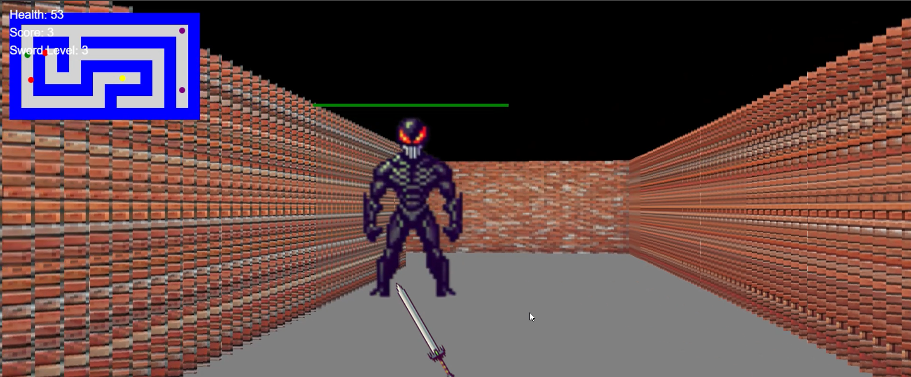

# Overtaken - A 3d Maze Game


## Table of Contents

- [Overview](#overview)
- [Features](#features)
- [Demo](#demo)
- [Technologies Used](#technologies-used)
- [Installation](#installation)
- [How to Play](#how-to-play)
- [Game Controls](#game-controls)
- [Project Structure](#project-structure)
- [Credits](#credits)
- [License](#license)

## Overview

Welcome to the **3D Maze Game**, an immersive browser-based game that challenges players to navigate through intricate mazes, battle enemies, and collect weapons across multiple levels. As you progress, each level introduces new mazes with increasing difficulty, more formidable enemies, and additional weapons to enhance your combat capabilities.

## Features

- **Multiple Levels**: Experience 10 distinct levels, each with unique mazes and escalating difficulty.
- **Dynamic Enemies**: Face a growing number of enemies with increasing health as you advance.
- **Weapon System**: Pick up and wield a sword to attack enemies and defend yourself.
- **Health Potions**: Collect potions to restore health during your journey.
- **Weapon Power-Ups**: The more swords you collect, the more powerful your weapon becomes.
- **Sound Effects**: Enjoy dynamic sound effects generated using the Web Audio API, enhancing the gaming experience without external audio files.
- **Mini-Map**: Keep track of your position, enemies, and weapon placements with an intuitive mini-map.
- **Health Indicators**: Monitor both your health and enemy health through visual indicators.
- **Responsive Design**: Play seamlessly across various screen sizes and devices.
- **Game Over & Victory Screens**: Receive clear feedback on your performance with options to restart or proceed.

## Demo

[](./docs/game_play.mp4)

*Click the image above to watch a demo of the game.*

## Technologies Used

- **HTML5**: Structuring the game interface.
- **CSS3**: Styling and responsive design.
- **JavaScript (ES6)**: Game logic, raycasting, rendering, and audio management.
- **Web Audio API**: Generating dynamic sound effects.
- **Canvas API**: Rendering the 3D environment and sprites.

## Installation

To get started with the **3D Maze Game**, follow the steps below:

## Installation

To get started with the **3D Maze Game**, follow the steps below:

1. **Clone the Repository**

   ```bash
   git clone https://github.com/fraher/3d-maze-game.git
   ```

2. **Navigate to the Project Directory**

   ```bash
   cd 3d-maze-game
   ```

3. **Run a Local Server**

   Since the game utilizes assets like images, it's recommended to run it on a local server to avoid CORS issues.

   - **Using Python's SimpleHTTPServer**

     ```bash
     # For Python 3.x
     python -m http.server 8000
     ```

     Open your browser and navigate to `http://localhost:8000`.

   - **Using VS Code Live Server Extension**

     - Install the [Live Server](https://marketplace.visualstudio.com/items?itemName=ritwickdey.LiveServer) extension.
     - Open the project in VS Code.
     - Right-click on `index.html` and select **"Open with Live Server"**.

## How to Play

Embark on a thrilling journey through a series of challenging mazes. Your objective is to navigate each maze, eliminate all enemies, collect health potions, and gather as many swords as possible to enhance your combat strength. Survive the onslaught, manage your health, and aim to complete all 10 levels to achieve victory!

## Game Controls

Master the controls to maneuver through the maze and engage enemies effectively.

- **Movement**
  - **W / Arrow Up**: Move Forward
  - **S / Arrow Down**: Move Backward
  - **A / Arrow Left**: Turn Left
  - **D / Arrow Right**: Turn Right

- **Combat**
  - **Spacebar**: Attack with Sword

- **Additional**
  - **Click to Focus**: Click anywhere on the game canvas to focus and enable keyboard controls.

## Project Structure

Here's an overview of the project's file structure:

```
3d-maze-game/
├── index.html
├── gameover.html
├── levelcomplete.html
├── game.js
├── styles.css
├── README.md
└── textures/
    ├── wall.png
    ├── wall_128.png
    ├── wall_64.png
    ├── wall_32.png
    ├── wall_16.png
    ├── enemy.png
    ├── weapon.png
    ├── sword.png
    ├── potion.png
```

- **index.html**: The main game page where gameplay occurs.
- **gameover.html**: Displayed when the player dies, showing the final score and an option to restart.
- **levelcomplete.html**: Shown upon completing a level, indicating progression to the next level.
- **game.js**: Contains all the game logic, including rendering, player controls, enemy behavior, and level management.
- **styles.css**: Styles for the game and overlays.
- **textures/**: Directory containing all image assets used in the game.

## Credits

This README, game,and graphics were 95% generated using GPT-4, GPT-4-turbo, and GPT-o1-mini.

## License

This project is licensed under the [MIT License](LICENSE).

---

## Contribution

Contributions are welcome! If you'd like to enhance the game, fix bugs, or add new features, feel free to open an issue or submit a pull request.

1. **Fork the Repository**
2. **Create a Feature Branch**

   ```bash
   git checkout -b feature/YourFeature
   ```

3. **Commit Your Changes**

   ```bash
   git commit -m "Add Your Feature"
   ```

4. **Push to the Branch**

   ```bash
   git push origin feature/YourFeature
   ```

5. **Open a Pull Request**

---

**Enjoy navigating the 3D mazes and conquering all challenges! Good luck! 🚀**
